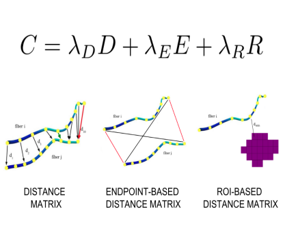

### app-multi-lap-anat
This app segments white matter bundles by solving Anatomically-Informed multiple Linear Assignment Problems (multi-LAP-anat). The method is a supervised example-based segmentation method, and thus requires multiple bundles as examples to learn from. The segmentation is performed by means of fiber correspondence across subjects by considering both the shape of the fibers and their relative anatomical position.

### Authors
- Giulia Bertò (gberto@fbk.eu)
- Emanuele Olivetti (olivetti@fbk.eu)
- Paolo Avesani (avesani@fbk.eu)

### Funding 

### Running the app
On [BrainLife.io](http://brainlife.io/) \
You can submit this App online at https://doi.org/10.25663/brainlife.app.122 via the “Execute” tab.

Inputs: \
To perform the bundle segmentation, you need two key elements: (i) the tractogram of the (target) subject you want to extract the bundle from and (ii) the wmc segmentations of multiple (example) subjects you want to learn from. Moreover, you have to provide the anatomical T1s and the tractograms of the (example) subjects (which are used to apply an initial Streamline Linear Registration (SLR) between tractograms).  

Output: \
You will get the wmc segmentation of the (single) bundle of interest in the target subject.

Branch 1.0: \
The wmc segmentation files you have to provide as examples should be obtained using the AFQ algorithm (https://doi.org/10.25663/bl.app.13). \
You can choose the bundle to be segmented (one at the time) by providing the id related to the AFQ segmentation as follows: \
1 - Left Thalamic Radiation \
2 - Right Thalamic Radiation \
3 - Left Corticospinal \
4 - Right Corticospinal \
5 - Left Cingulum Cingulate \
6 - Right Cingulum Cingulate \
7 - Left Cingulum Hippocampus \
8 - Right Cingulum Hippocampus \
9 - Callosum Forceps Major \
10 - Callosum Forceps Minor \
11 - Left IFOF \
12 - Right IFOF \
13 - Left ILF \
14 - Right ILF \
15 - Left SLF \
16 - Right SLF \
17 - Left Uncinate \
18 - Right Uncinate \
19 - Left Arcuate \
20 - Right Arcuate 

Branch 1.1: \
In addition to use as examples AFQ wmc segmentations, you may also provide as examples the wmc segmentation obtained using the WMA algorithm (https://doi.org/10.25663/bl.app.41). In this case you have also to provide the freesufer parcellation file, which can be obtained by running the app https://doi.org/10.25663/bl.app.0. \
You can choose the bundle to be segmented (one at the time) by providing the id related to the WMA segmentation as follows: \
38 - Left pArc \
39 - Right pArc \
40 - Left TPC \
41 - Right TPC \
42 - Left MdLF-SPL \
43 - Right MdLF-SPL \
44 - Left MdLF-Ang \
45 - Right MdLF-Ang 
