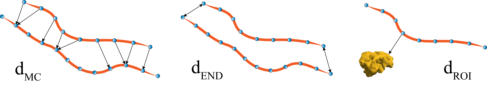

[](https://github.com/brain-life/abcd-spec)
[](https://doi.org/10.25663/brainlife.app.227)

# app-multi-lap-anat
This App segments white matter bundles by solving Anatomically-Informed multiple Linear Assignment Problems (multi-LAP-anat). The method is a supervised example-based segmentation method, and thus requires multiple bundles as examples to learn from. The segmentation is performed by means of fiber correspondence across subjects by considering both the shape of the fibers and their relative anatomical position.



### Authors
- Giulia Bertò (giulia.berto.4@gmail.com)

### Contributors
- Emanuele Olivetti (olivetti@fbk.eu)
- Paolo Avesani (avesani@fbk.eu)

### Funding Acknowledgement
brainlife.io is publicly funded and for the sustainability of the project it is helpful to Acknowledge the use of the platform. We kindly ask that you acknowledge the funding below in your publications and code reusing this code.

[](https://nsf.gov/awardsearch/showAward?AWD_ID=1734853)
[](https://nsf.gov/awardsearch/showAward?AWD_ID=1636893)
[](https://nsf.gov/awardsearch/showAward?AWD_ID=1916518)
[](https://nsf.gov/awardsearch/showAward?AWD_ID=1912270)
[](https://grantome.com/grant/NIH/R01-EB029272-01)

### Citation
We kindly ask that you cite the following article when publishing papers and code using this code: 
1. ["Anatomically-Informed Multiple Linear Assignment Problems for White Matter Bundle Segmentation."](https://doi.org/10.1109/ISBI.2019.8759174), Bertò, G., Avesani, P., Pestilli, F., Bullock, D., Caron, B. and Olivetti, E., 2019, April. Anatomically-Informed Multiple Linear Assignment Problems for White Matter Bundle Segmentation. In 2019 IEEE 16th International Symposium on Biomedical Imaging (ISBI 2019) (pp. 135-138). IEEE.
2. Avesani, P., McPherson, B., Hayashi, S. et al. The open diffusion data derivatives, brain data upcycling via integrated publishing of derivatives and reproducible open cloud services. Sci Data 6, 69 (2019). [https://doi.org/10.1038/s41597-019-0073-y](https://doi.org/10.1038/s41597-019-0073-y)

### Running the app
### On [Brainlife.io](http://brainlife.io/) 
You can submit this App online at https://doi.org/10.25663/brainlife.app.227 via the “Execute” tab.

Inputs: \
To perform the bundle segmentation, you need two key elements: (i) the tractogram of the (target) subject you want to extract the bundle from and (ii) the wmc segmentations of multiple (example) subjects you want to learn from. Moreover, you have to provide the anatomical T1s and the tractograms of the (example) subjects (which are used to apply an initial Streamline Linear Registration (SLR) between tractograms).  

Output: \
You will get the wmc segmentation of the bundle(s) of interest in the target subject.

#### Branch 1.0:
The wmc segmentation files you have to provide as examples should be obtained using the AFQ algorithm (https://doi.org/10.25663/bl.app.13). \
You can choose the bundle to be segmented (one at the time) by providing the id related to the AFQ segmentation as follows: \
1 - Left Thalamic Radiation \
2 - Right Thalamic Radiation \
3 - Left Corticospinal \
4 - Right Corticospinal \
5 - Left Cingulum Cingulate \
6 - Right Cingulum Cingulate \
7 - Left Cingulum Hippocampus \
8 - Right Cingulum Hippocampus \
9 - Callosum Forceps Major \
10 - Callosum Forceps Minor \
11 - Left IFOF \
12 - Right IFOF \
13 - Left ILF \
14 - Right ILF \
15 - Left SLF \
16 - Right SLF \
17 - Left Uncinate \
18 - Right Uncinate \
19 - Left Arcuate \
20 - Right Arcuate \
This branch is associated with the App https://doi.org/10.25663/brainlife.app.122 (deprecated).

#### Branch 1.1:
In addition to use as examples AFQ wmc segmentations, you may also provide as examples the wmc segmentation obtained using the WMA algorithm (https://doi.org/10.25663/bl.app.41). In this case you have also to provide the freesufer parcellation file, which can be obtained by running the app https://doi.org/10.25663/bl.app.0. \
You can choose the bundle to be segmented (one at the time) by providing the id related to the WMA segmentation as follows: \
38 - Left pArc \
39 - Right pArc \
40 - Left TPC \
41 - Right TPC \
42 - Left MdLF-SPL \
43 - Right MdLF-SPL \
44 - Left MdLF-Ang \
45 - Right MdLF-Ang \
This branch is associated with the App https://doi.org/10.25663/brainlife.app.122 (deprecated).

#### Branch 2.0:
This branch implements the same functionalities of the branch 1.1 but with the following changes: 
- uses the new wmc input 
- SLR registration is optional
- can run multiple bundles at the same time 

You may provide as examples AFQ segmentations obtained by the app https://doi.org/10.25663/brainlife.app.207 or WMA segmentations obtained by the app https://doi.org/10.25663/brainlife.app.188.

### Running locally
1. git clone this repo.
2. Inside the cloned directory, create `config.json` with something like the following content with paths to your input files:
```
{
    "tractogram_static": "./track.tck",
    "t1_static": "./t1.nii.gz",
    "segmentations": [
        "./sub-1/classification.mat",           
        "./sub-2/classification.mat"
    ],
    "tracts": [
        "./sub-1/tracts",
        "./sub-2/tracts"
    ],
    "tractograms_moving": [
        "./sub-1/track.tck",
        "./sub-2/track.tck"
    ],
    "t1s_moving": [
        "./sub-1/t1.nii.gz",
        "./sub-2/t1.nii.gz"
    ],
    "tractID_list": "11, 12, 19, 20"
}
```
3. Launch the App by executing `main`.
```
./main
```

### Output
The output is a wmc file containing the specified bundles segmented by multi-LAP-anat.

#### Dependencies
This App only requires [singularity](https://sylabs.io/singularity/) to run.

#### MIT Copyright (c) 2019 Bruno Kessler Foundation (FBK)
